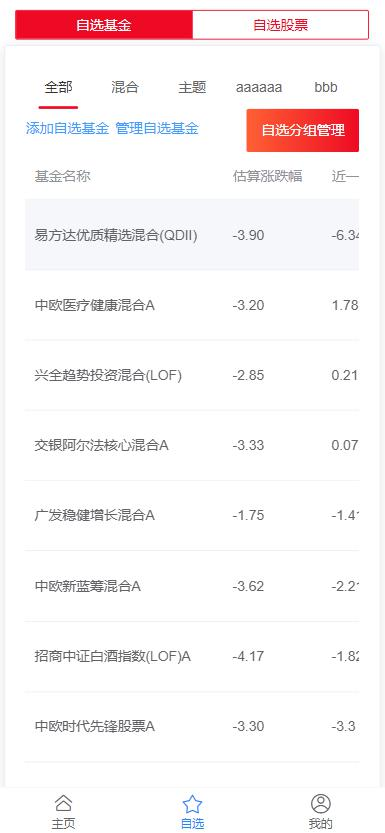

# 鸡圈儿

<!-- ```sh
启动热点

docker start nginx mysql redis mongo nacos  rabbitmq 
docker stop nginx mysql redis mongo nacos  rabbitmq 
es

cd ./frontend/jijuaner-app/ && npm run dev
cd ./backend/jijuaner-jsdata/ && npm run dev

cd A:\program\ding\
.\ding.exe -config="./ding.cfg" -subdomain="gateway.jijuaner" 50000

``` -->

## TODO

!!将金额数据用BigInteger保存, 并指明它的位数
使用 vuex 保存一些通用的信息

支付功能:
模拟基金公司的处理

自选功能：

详情页功能：
使用的应该是复权累积净值而不是累计净值
设置时间段
设置参考指数（数据从韭圈获得）
货币基金没有累计净值

设置功能：
忘记密码，重设密码

评论功能：
删除回复功能
有人回复后向用户发送通知

指数估值曲线（数据从韭圈获得）
投资箴言
模拟投资 + 量化
(文章发表)
系统消息
<!-- 恐贪指数（数据从韭圈获得） -->


## 整体设计

### 总体功能

登录
搜索
自选
评论
模拟支付
第三方服务

使用技术：
- SpringBoot
- SpringCloud
- MySQL
- Redis
- MongoDB
- Nginx
- RabbitMQ

### 微服务

- jijuaner-jsdata:33333 第三方服务
- jijuaner-gateway:88 网关服务
- jijuaner-fund:10000 基金信息服务
- jijuaner-user:20000 用户服务
- jijuaner-search:30000 搜索服务
- jijuaner-comment:40000 评论服务
- jijuaner-pay:50000 模拟支付服务
- fund-company:12345 模拟基金公司服务

## 接口设计

### 第三方接口

- 基金实时信息 `http://fundgz.1234567.com.cn/js/519983.js?rt=1463558676006`
  - `519983`为基金代码
  - `rt=1463558676006`为时间戳，避免缓存
- 所有基金列表 `http://fund.eastmoney.com/js/fundcode_search.js`
- 基金详细信息 `http://fund.eastmoney.com/pingzhongdata/005827.js?v=20160518155842`
- 实时净值估算图 `http://j4.dfcfw.com/charts/pic6/000689.png?v=20220306141111`
- 所有指数列表 `http://danjuanapp.com/djapi/index_eva/dj`

### 微服务接口

<!-- TODO -->

## 数据库设计

### 数据库设计概览

MySQL：
- jijuaner_user 
  - user_list 用户列表，包含用户注册、登录信息
  - user_option 用户自选基金

MongoDB：
- jijuaner_fund
  - fund_list 所有基金列表
  - fund_info 基金详情信息
- jijuaer_comment
  - fund_comment 对基金的评论
  - fund_comment_reply 对评论的回复

Redis：
- spring:session
- jijuaner(fund)
  - fundList::getAll 全部基金列表的缓存
  - fundInfo::\<fundCode> 对应基金详情信息缓存
  - fundSimpleInfo::\<fundCode> 对应基金简单信息的缓存
  - fundType::\<fundCode> 对应基金类型缓存
  - indexList::getAll 全部指数列表的缓存
  - indexInfo:indexCode 指数列表
    - indexInfo:indexCode:time 上一次获取指数列表的时间
- jijuaner(user)
  - code:\<userId> 用户的验证码
  - allOptionFunds:\<userId> 对应用户的全部自选基金

es：
- jijuaner_fundlist 所有基金列表

### jijuaner_fund

#### fund_list (MongoDB)

- _id(fundCode) 主键 基金代码
- fundName 基金名称中文
- fundType 基金类型

#### jijuaner_fundlist (ES)

```es
PUT jijuaner_fundlist
{
  "mappings": {
    "properties": {
      "fundCode": {
        "type": "keyword"
      },
      "fundNameSingleSpell": {
        "type": "keyword"
      },
      "fundName": {
        "type": "text",
        "analyzer": "ik_smart"
      },
      "fundNameAllSpell": {
        "type": "keyword"
      },
      "fundType": {
        "type": "text",
        "analyzer": "ik_smart"
      },
    }
  }
}
```

#### fund_info (MongoDB)

fundInfo:fundCode 是基金信息的缓存，如果 fundInfo:fundCode:time 的时间已过去 6 个小时，则需要从 jsdata 服务中重新获取

- fundCode 主键 基金代码
- fundName 基金名称
- yieldOneYear 近一年收益率
- yieldSixMonths 近六个月收益率
- yieldThreeMonths 近三个月收益率
- yieldOneMonth 近一个月收益率
- fundType 基金类型
- acWorthTrend 成立以来累计净值走势
  - x 时间戳（微秒）
  - y 累计净值
- ranksInSimilarType 同类排名
  - x 时间戳（微秒）
  - y 排名
  - total 同类总数
- currentManagers
  - managerId 经理代码
  - pic 经理图片
  - name 经理名字
  - workTime 从业年限
  - fundSize 在管规模
- scales
  - x 日期字符串
  - y 表示规模的字符串

#### indexList (Redis)

- id
- indexCode 指数代码
- indexName 指数名称
- pe PE
- pb PB
- pePercentile PE百分位
- pbPercentile PB百分位
- roe ROE
- yield 股息率
- peg PEG
- pbFlag PB估值是否适用
- evalType 估值情况

### jijuaner_user

#### user_list (MySQL)

```sql
CREATE TABLE user_list(
    `user_id` INT(11) PRIMARY KEY AUTO_INCREMENT COMMENT '主键 用户id',
    `user_name` VARCHAR(32) COMMENT '用户名称',
    `email` VARCHAR(64) UNIQUE COMMENT '邮箱',
    `password` VARCHAR(128) COMMENT '密码',
    `head_img` VARCHAR(256) COMMENT '头像链接'
) ENGINE=INNODB DEFAULT CHARSET=UTF8 AUTO_INCREMENT=1 COMMENT '所有用户列表';
```

#### user_option (MySQL)

```sql
CREATE TABLE user_option(
    `group_id` INT(11) PRIMARY KEY AUTO_INCREMENT COMMENT '分组id',
    `user_id` INT(11) NOT NULL COMMENT '用户id', -- 需要建索引
    `sort` TINYINT(3) NOT NULL COMMENT '排序',
    `group_name` VARCHAR(10) COMMENT '分组名称',
    `funds` TEXT COMMENT '分组中的基金id列表'
) ENGINE=INNODB DEFAULT CHARSET=UTF8 AUTO_INCREMENT=1 COMMENT '用户自选基金分组信息';
```

#### allOptionFunds (Redis)

jijuaner:allOptionFunds:\<userId> 数据结构为 set，set 中是对应用户全部自选基金代码

### jijuaner_comment

#### fund_comment (Mongodb)

- id
- fundCode 对哪只基金评论
- userId 用户id
- time 评论时间
- content 评论内容
- likes 点赞数
- replyNum 回复数
- likeUsers 点赞的用户集合

#### fund_comment_reply (MongoDB)

- id
- userId 用户id
- toCommentId 对哪个评论回复
- time 回复时间
- content 回复内容
- likes 点赞数
- replyNum 回复数
- likeUsers 点赞的用户集合
- replyL2 二级回复
  - toUserId 对哪个用户回复
  - userId 用户id
  - time 回复时间
  - content 回复内容

### jijuaner_notice

<!-- TODO -->

### jijuaner_pay

#### fund_pay_info (MongoDB)

- fundCode 基金代码
- fundName 基金名称
- fundType 基金类型
- subscriptionStatus 申购状态
- redemptionStatus 赎回状态
- nextOpenDay 下一个开放日
- minAmount 购买起点
- serviceCharge 日累计限定额
- maxAmountPerDay 手续费

#### transaction (MySQL)

```sql
CREATE TABLE transaction(  
    id BIGINT PRIMARY KEY COMMENT '雪花算法生成的交易id',
    user_id INT COMMENT '交易的用户',
    amount DECIMAL COMMENT '交易的金额',
    `type` ENUM('UNPAYED_SUBSCRIBE',
                'PAYED_SUBSCRIBE',
                'REDEEM',
                'CANCEL_SUBSCRIBE',
                'CANCEL_REDEEM',
                'SUBSCRIBE_DONE',
                'SUBSCRIBE_TIMEOUT',
                'REDEEM_DONE') COMMENT '交易类型',
    fund_code VARCHAR(16) COMMENT '基金代码',
    `time` BIGINT COMMENT '发起交易的时间'
) ENGINE=INNODB DEFAULT CHARSET UTF8 COMMENT '交易列表';
```

#### porperty

```sql
CREATE TABLE property(
    id BIGINT PRIMARY KEY AUTO_INCREMENT COMMENT '',
    user_id INT COMMENT '对应资产的用户',
    amount DECIMAL COMMENT '资产的份额',
    fund_code VARCHAR(16) COMMENT '基金代码'
) ENGINE=INNODB DEFAULT CHARSET UTF8 AUTO_INCREMENT=1 COMMENT '资产列表';
```

#### alipay_order

```sql
CREATE TABLE alipay_order(
    id BIGINT PRIMARY KEY COMMENT '交易id',
    trade_no VARCHAR(64) COMMENT '支付宝流水号',
    buyer_id VARCHAR(16) COMMENT '支付者的id',
    seller_id VARCHAR(30) COMMENT '商家的id',
    buyer_pay_amount DECIMAL COMMENT '用户支付的金额',
    total_amount DECIMAL COMMENT '订单支付的总额',
    receipt_amount DECIMAL COMMENT '商家收到的款',
    invoice_amount DECIMAL COMMENT '可开发票的金额',
    `subject` VARCHAR(256) COMMENT '支付时显示的主题',
    body VARCHAR(400) COMMENT '支付时显示的订单信息',
    gmt_create VARCHAR(20) COMMENT '该笔交易创建的时间',
    gmt_payment VARCHAR(20) COMMENT '该笔交易支付的时间',
    gmt_close VARCHAR(20) COMMENT '该笔交易结束的时间',
    notify_time VARCHAR(20) COMMENT '通知发送的时间',
    notify_id VARCHAR(128) COMMENT '通知id',
    notify_type VARCHAR(64) COMMENT '通知类型',
    trade_status ENUM('WAIT_BUYER_PAY', 'TRADE_CLOSED', 'TRADE_SUCCESS', 'TRADE_FINISHED') COMMENT '交易状态',
    fund_bill_list VARCHAR(512) COMMENT '支付成功的各个渠道金额信息'
) ENGINE=INNODB DEFAULT CHARSET UTF8 COMMENT '支付宝交易订单列表';
```


### fund_company

## 前端 app 设计

### 首页

#### 主页


#### 自选



#### 我的


### 搜索


### 信息


### 用户管理

#### 登录和注册


#### 设置


### 评论

#### 评论列表


#### 全部回复


### 支付


### 主页功能

#### 指数估值


#### 量化

敬请期待
