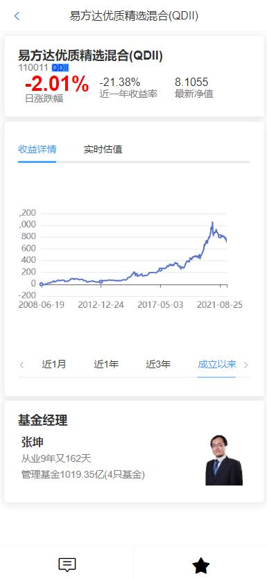

# 鸡圈儿文档

## TODO

自选功能：
!! 通过基金id得到基金名字、涨跌幅、估值

详情页功能：
设置时间段
设置参考指数
(货币基金没有累计净值)

设置功能

指数估值
投资箴言
(模拟投资)
（量化）

## 整体设计

### 总体功能

登录
搜索
自选
第三方服务

使用技术：
- springboot
- springcloud
- mysql
- redis
- nginx

### 微服务

- jijuaner-jsdata:33333 第三方服务
- jijuaner-gateway:88 网关服务
- jijuaner-fund:10000 基金信息服务
- jijuaner-user:20000 用户服务
- jijuaner-search:30000 搜索服务

## 接口设计

### 第三方接口

#### 获取所有基金名称

`get http://fund.eastmoney.com/js/fundcode_search.js`

```json
var r = [
    ["000001","HXCZHH","华夏成长混合","混合型-偏股","HUAXIACHENGZHANGHUNHE"],
    // 基金代码、基金名称单拼、基金名称中文、基金类型、基金名称全拼
    ["000002","HXCZHH","华夏成长混合(后端)","混合型-偏股","HUAXIACHENGZHANGHUNHE"],
    // ...
]
```

#### 获取基金实时信息

`http://fundgz.1234567.com.cn/js/519983.js?rt=1463558676006`

- `519983`为基金代码
- `rt=1463558676006`为时间戳，避免缓存

```json
jsonpgz({
    "fundcode":"005827",  // 基金代码
    "name":"易方达蓝筹精选混合",  // 基金名字
    "jzrq":"2021-12-23",  // 截止日期
    "dwjz":"2.6359",  // 单位净值
    "gsz":"2.6478",  // 估算值
    "gszzl":"0.45",  // 估算增长率
    "gztime":"2021-12-24 15:00"  // 估值时间
});
```

## 数据库设计

### 数据库设计概览

MySQL：
- fund 基金净值数据
  - fund_list 所有基金列表
- user 用户注册、登录信息
  - user_list 用户列表
  - user_option 用户自选基金
- optical 自选基金

Redis：
- session
- fund 基金净值数据缓存、基金估值数据缓存
  - fundList::getAll 全部基金的列表缓存
  - fundInfo:fundCode 对应基金的全部信息
    - fundInfo:fundCode:time 上一次获取对应基金的时间
  - indexList::getAll 全部指数的列表缓存
  - indexInfo:indexCode 对应指数的全部信息
    - indexInfo:indexCode:time 上一次获取对应指数的时间
- user 用户
  - allOptionFunds:userId 对应用户的全部自选基金

es：
- jijuaner_fundlist 所有基金列表

### jijuaner_fund

```sql
CREATE DATABASE `jijuaner_fund` DEFAULT CHARACTER SET = 'utf8mb4';
```

#### fund_list (MySQL)

- fund_code 主键 基金代码
- fund_name 基金名称中文
- fund_type 基金类型

```sql
CREATE TABLE fund_list(
    fund_code VARCHAR(10) PRIMARY KEY COMMENT '基金代码',
    fund_name VARCHAR(64) COMMENT '基金名称中文',
    fund_type VARCHAR(16) COMMENT '基金类型'
) ENGINE=INNODB DEFAULT CHARSET=UTF8 COMMENT '所有基金列表';
```

#### fundList::getAll (Redis)

对 fundList 进行缓存

#### fundName (Redis)

对 fundList 中的 fundName 进行缓存

#### fundInfo (Redis)

fundInfo:fundCode 是基金信息的缓存，如果 fundInfo:fundCode:time 的时间已过去 6 个小时，则需要从 jsdata 服务中重新获取

- fundCode 主键 基金代码
- fundName 基金名称
- yieldOneYear 近一年收益率
- yieldSixMonths 近六个月收益率
- yieldThreeMonths 近三个月收益率
- yieldOneMonth 近一个月收益率
- fundType 基金类型
- acWorthTrend 成立以来累计净值走势
  - x 时间戳（微秒）
  - y 累计净值
- ranksInSimilarType 同类排名
  - x 时间戳（微秒）
  - y 排名
  - total 同类总数
- currentManagers
  - managerId 经理代码
  - pic 经理图片
  - name 经理名字
  - workTime 从业年限
  - fundSize 在管规模
- scales
  - x 日期字符串
  - y 表示规模的字符串

#### indexList 

### jijuaner_user

```sql
CREATE DATABASE `jijuaner_user` DEFAULT CHARACTER SET = 'utf8mb4';
```

#### user_list (MySQL)

- user_id 主键 自增 用户 id
- user_name 用户名称
- email 邮箱
- password 密码
<!-- TODO --> 
- head_img 头像链接

```sql
CREATE TABLE user_list(
    `user_id` INT(11) PRIMARY KEY AUTO_INCREMENT COMMENT '主键 用户id',
    `user_name` VARCHAR(32) COMMENT '用户名称',
    `email` VARCHAR(64) UNIQUE COMMENT '邮箱',
    `password` VARCHAR(128) COMMENT '密码',
    `head_img` VARCHAR(256) COMMENT '头像链接'
) ENGINE=INNODB DEFAULT CHARSET=UTF8 AUTO_INCREMENT=1 COMMENT '所有用户列表';
```

#### user_option (MySQL)

- group_id 分组 id
- user_id 用户 id
- sort 排序
- group_name 分组名称
- funds 基金 id 列表

```sql
CREATE TABLE user_option(
    `group_id` INT(11) PRIMARY KEY AUTO_INCREMENT COMMENT '分组id',
    `user_id` INT(11) NOT NULL COMMENT '用户id', -- 需要建索引
    `sort` TINYINT(3) NOT NULL COMMENT '排序',
    `group_name` VARCHAR(10) COMMENT '分组名称',
    `funds` TEXT COMMENT '分组中的基金id列表'
) ENGINE=INNODB DEFAULT CHARSET=UTF8 AUTO_INCREMENT=1 COMMENT '用户自选基金分组信息';
```

#### allOptionFunds (Redis)

jijuaner:allOptionFunds:userId 数据结构为 set，set 中是全部自选基金代码

### jijuaner_fundlist (ES)

```es
PUT jijuaner_fundlist
{
  "mappings": {
    "properties": {
      "fundCode": {
        "type": "keyword"
      },
      "fundNameSingleSpell": {
        "type": "keyword"
      },
      "fundName": {
        "type": "text",
        "analyzer": "ik_smart"
      },
      "fundNameAllSpell": {
        "type": "keyword"
      },
      "fundType": {
        "type": "text",
        "analyzer": "ik_smart"
      },
    }
  }
}
```

## 前端 app 设计

- 头栏：logo、搜索框
- 底栏：首页、自选、我的

- 首页：头栏、特色功能
- 自选：分类栏、列表（预估净值、净值）
- 基金页面：简介、收益曲线
- 我的：个人信息框、设置



